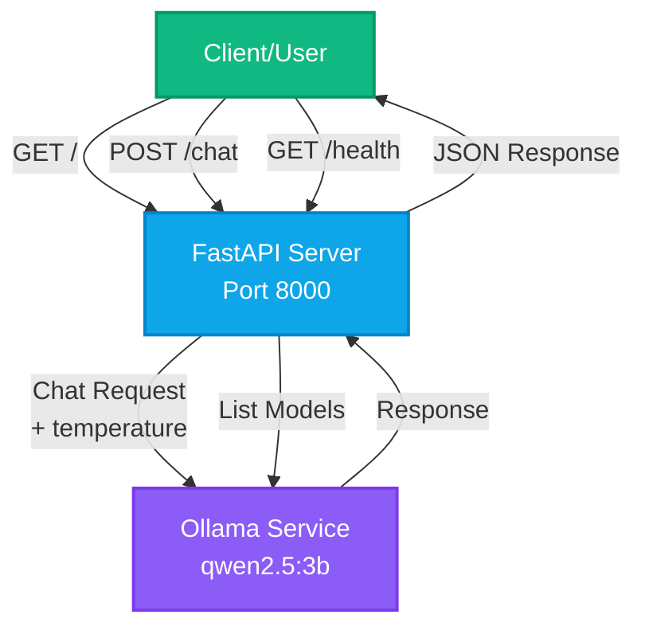
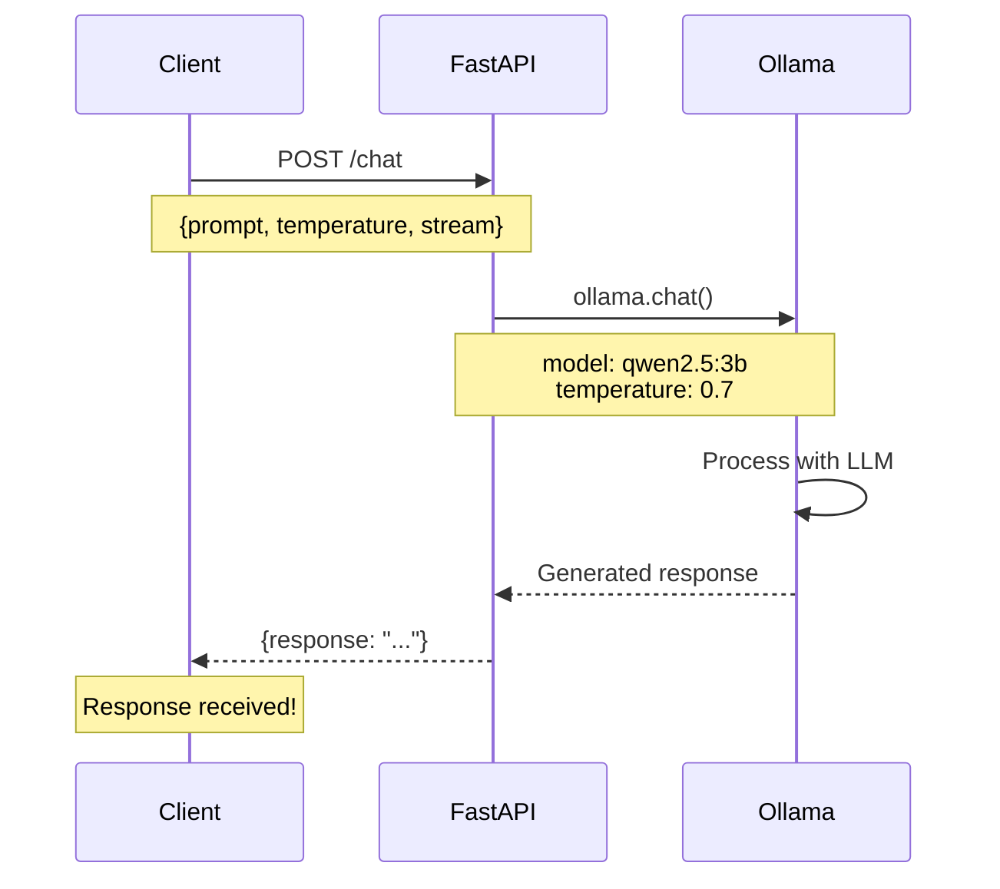

# Local LLM API

A simple and lightweight FastAPI application that uses Ollama with the qwen2.5:3b model.

## Architecture



## Request Flow



## Prerequisites

- Python 3.12+
- [uv](https://github.com/astral-sh/uv) package manager
- [Ollama](https://ollama.ai/) installed and running
- qwen2.5:3b model pulled in Ollama

## Setup

1. Install dependencies:
```bash
uv sync
```

2. Make sure Ollama is running and has the qwen2.5:3b model:
```bash
ollama pull qwen2.5:3b
```

## Running the API

Start the server:
```bash
uv run python main.py
```

Or with uvicorn directly:
```bash
uv run uvicorn main:app --reload --host 0.0.0.0 --port 8000
```

The API will be available at `http://localhost:8000`

## API Endpoints

### `GET /`
Health check endpoint that returns basic info about the API.

**Example curl command:**
```bash
curl http://localhost:8000/
```

**Response:**
```json
{
  "message": "Local LLM API is running",
  "model": "qwen2.5:3b"
}
```

### `POST /chat`
Send a prompt to the qwen2.5:3b model.

**Example curl command:**
```bash
curl -X POST http://localhost:8000/chat \
  -H "Content-Type: application/json" \
  -d '{"prompt": "What is the capital of France?", "temperature": 0.7}'
```

**Request Body:**
```json
{
  "prompt": "What is the capital of France?",
  "stream": false,
  "temperature": 0.7
}
```

**Parameters:**
- `prompt` (string, required): The text prompt to send to the model
- `stream` (boolean, optional): Enable streaming response (default: false)
- `temperature` (float, optional): Controls randomness in responses. Range: 0.0-2.0 (default: 0.7)
  - Lower values (e.g., 0.1) make output more focused and deterministic
  - Higher values (e.g., 1.5) make output more creative and random

**Response:**
```json
{
  "response": "The capital of France is Paris."
}
```

### `GET /health`
Check if the API and Ollama connection are working.

**Example curl command:**
```bash
curl http://localhost:8000/health
```

**Response:**
```json
{
  "status": "healthy",
  "ollama_connected": true,
  "models_available": 5
}
```

## More Example Commands

**Test the root endpoint:**
```bash
curl http://localhost:8000/
```

**Ask a simple question:**
```bash
curl -X POST http://localhost:8000/chat \
  -H "Content-Type: application/json" \
  -d '{"prompt": "Tell me a joke about programming"}'
```

**Ask a question with pretty-printed output:**
```bash
curl -X POST http://localhost:8000/chat \
  -H "Content-Type: application/json" \
  -d '{"prompt": "Explain what FastAPI is in one sentence"}' | jq
```

**Use a low temperature for more focused/deterministic responses:**
```bash
curl -X POST http://localhost:8000/chat \
  -H "Content-Type: application/json" \
  -d '{"prompt": "What is 2+2?", "temperature": 0.1}'
```

**Use a high temperature for more creative responses:**
```bash
curl -X POST http://localhost:8000/chat \
  -H "Content-Type: application/json" \
  -d '{"prompt": "Write a creative story opening", "temperature": 1.5}'
```

**Enable streaming (note: currently returns full response):**
```bash
curl -X POST http://localhost:8000/chat \
  -H "Content-Type: application/json" \
  -d '{"prompt": "Count to 5", "stream": true}'
```

**Check API health:**
```bash
curl http://localhost:8000/health
```

Using Python:
```python
import requests

response = requests.post(
    "http://localhost:8000/chat",
    json={"prompt": "What is FastAPI?"}
)
print(response.json()["response"])
```

## Interactive API Documentation

FastAPI provides automatic interactive API documentation:
- Swagger UI: `http://localhost:8000/docs`
- ReDoc: `http://localhost:8000/redoc`

## Project Structure

```
local-llm-api/
├── main.py           # FastAPI application
├── pyproject.toml    # Project dependencies
├── uv.lock          # Locked dependencies
└── README.md        # This file
```

