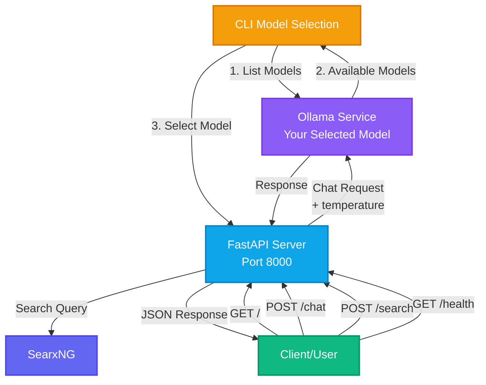
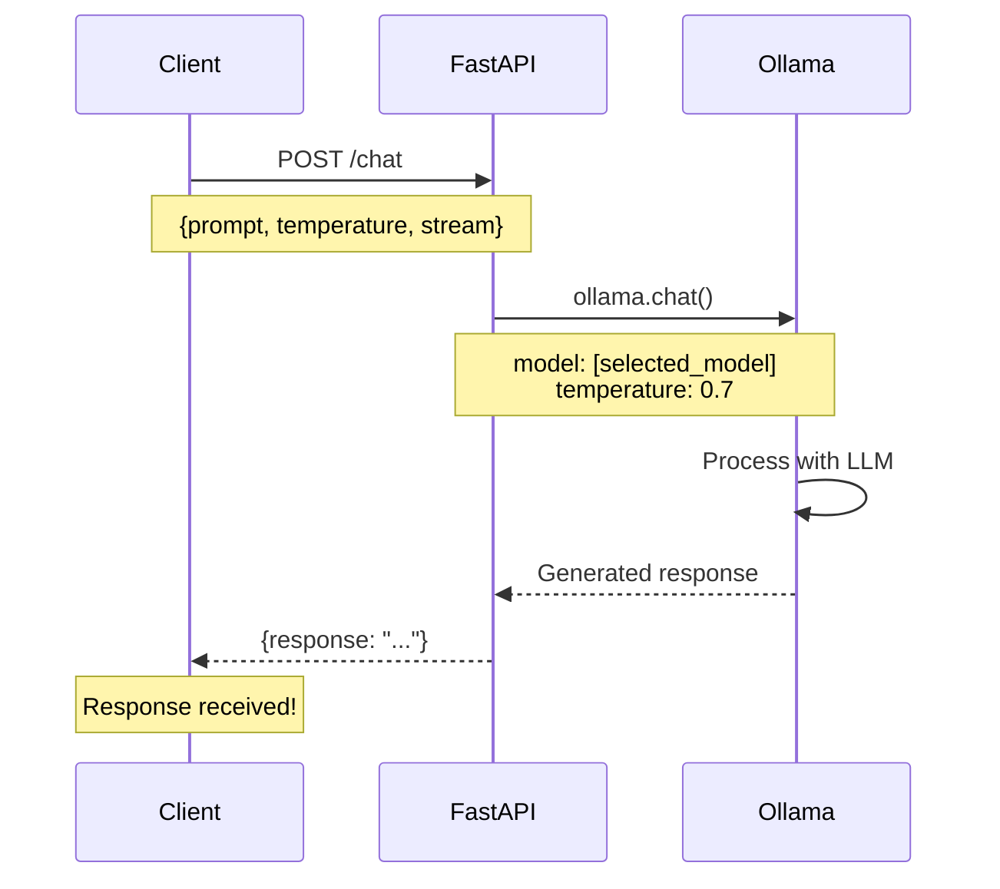

# Local LLM API

A simple and lightweight FastAPI application that uses Ollama with dynamic model selection. Choose any installed Ollama model at startup via an interactive CLI prompt.

## Features

- **Dynamic Model Selection**: Auto-detects all installed Ollama models and lets you choose at startup
- **Interactive CLI**: Simple numbered menu to select your preferred model
- **Temperature Control**: Adjust response randomness (0.0-2.0)
- **Streaming Support**: Enable streaming responses (basic implementation)
- **Health Monitoring**: Check Ollama connectivity and see which model is active
- **Web Search (SearxNG)**: Optional `/search` endpoint and search-augmented chat
- **Automatic API Docs**: Built-in Swagger UI and ReDoc documentation
- **Lightweight**: Minimal dependencies, fast startup, perfect for edge devices

## Architecture



## Request Flow



## Prerequisites

- Python 3.12+
- [uv](https://github.com/astral-sh/uv) package manager
- [Ollama](https://ollama.ai/) installed and running
- At least one model installed in Ollama

## Setup

1. Install dependencies:
```bash
uv sync
```

2. Make sure Ollama is running and has at least one model installed:
```bash
# Example: Install a model (choose any model you prefer)
ollama pull qwen2.5:3b
# Or
ollama pull llama3.1:8b
# Or
ollama pull mistral:7b
```

## Running the API

Start the server:
```bash
uv run python main.py
```

You'll be prompted to select a model from your available Ollama models:
```
Available Ollama models:
------------------------------
  1. llama3.1:8b-instruct-q4_K_M
  2. qwen2.5:3b
  3. mistral:7b
------------------------------
Select a model (1-3): 2
Selected: qwen2.5:3b

Starting API server with model: qwen2.5:3b
INFO:     Uvicorn running on http://0.0.0.0:8000
```

**Note:** If you run with uvicorn directly, model selection won't work:
```bash
# This bypasses the CLI selection - not recommended
uv run uvicorn main:app --reload --host 0.0.0.0 --port 8000
```

The API will be available at `http://localhost:8000`

### Search configuration (SearxNG)
Set these environment variables if you want search enabled:
```
SEARXNG_URL=http://localhost:8080
SEARXNG_API_KEY=optional-api-key
```

Note: the API forwards the client IP to SearxNG via `X-Forwarded-For` / `X-Real-IP`
to satisfy SearxNG botdetection defaults.

Start/stop SearxNG (Docker):
```bash
make start-searxng
make stop-searxng
```

## API Endpoints

### `GET /`
Health check endpoint that returns basic info about the API.

**Example curl command:**
```bash
curl http://localhost:8000/
```

**Response:**
```json
{
  "message": "Local LLM API is running",
  "model": "llama3.1:8b-instruct-q4_K_M"
}
```

### `POST /chat`
Send a prompt to your selected model.

**Example curl command:**
```bash
curl -X POST http://localhost:8000/chat \
  -H "Content-Type: application/json" \
  -d '{"prompt": "What is the capital of France?", "temperature": 0.7}'
```

**Request Body:**
```json
{
  "prompt": "What is the capital of France?",
  "stream": false,
  "temperature": 0.7,
  "use_search": false,
  "search_query": null,
  "search_max_results": 5
}
```

**Parameters:**
- `prompt` (string, required): The text prompt to send to the model
- `stream` (boolean, optional): Enable streaming response (default: false)
- `temperature` (float, optional): Controls randomness in responses. Range: 0.0-2.0 (default: 0.7)
  - Lower values (e.g., 0.1) make output more focused and deterministic
  - Higher values (e.g., 1.5) make output more creative and random
- `use_search` (boolean, optional): If true, uses SearxNG results to ground the response
- `search_query` (string, optional): Override the search query (defaults to the prompt)
- `search_max_results` (int, optional): Limit number of results (default: 5)

**Response:**
```json
{
  "response": "The capital of France is Paris."
}
```

### `GET /health`
Check API and Ollama connectivity, and see which model is currently selected.

**Example curl command:**
```bash
curl http://localhost:8000/health
```

**Response:**
```json
{
  "status": "healthy",
  "ollama_connected": true,
  "selected_model": "llama3.1:8b-instruct-q4_K_M",
  "models_available": 3
}
```

### `POST /search`
Run a web search via SearxNG.

**Example curl command:**
```bash
curl -X POST http://localhost:8000/search \
  -H "Content-Type: application/json" \
  -d '{"query": "FastAPI", "max_results": 3}'
```

**Response:**
```json
{
  "results": [
    {
      "title": "FastAPI",
      "url": "https://fastapi.tiangolo.com/",
      "snippet": "FastAPI framework..."
    }
  ]
}
```

## More Example Commands

**Test the root endpoint:**
```bash
curl http://localhost:8000/
```

**Ask a simple question:**
```bash
curl -X POST http://localhost:8000/chat \
  -H "Content-Type: application/json" \
  -d '{"prompt": "Tell me a joke about programming"}'
```

**Ask a question with pretty-printed output:**
```bash
curl -X POST http://localhost:8000/chat \
  -H "Content-Type: application/json" \
  -d '{"prompt": "Explain what FastAPI is in one sentence"}' | jq
```å

**Enable streaming (note: currently returns full response):**
```bash
curl -X POST http://localhost:8000/chat \
  -H "Content-Type: application/json" \
  -d '{"prompt": "Count to 5", "stream": true}'
```

**Search-augmented chat:**
```bash
curl -X POST http://localhost:8000/chat \
  -H "Content-Type: application/json" \
  -d '{"prompt": "What is the latest Node.js LTS?", "use_search": true}'
```

Using Python:
```python
import requests

response = requests.post(
    "http://localhost:8000/chat",
    json={"prompt": "What is FastAPI?"}
)
print(response.json()["response"])
```

## Interactive API Documentation

FastAPI provides automatic interactive API documentation:
- Swagger UI: `http://localhost:8000/docs`
- ReDoc: `http://localhost:8000/redoc`

## Project Structure

```
local-llm-api/
├── main.py           # FastAPI application
├── pyproject.toml    # Project dependencies
├── uv.lock          # Locked dependencies
└── README.md        # This file
```

## AWS Edge Device Use Cases

This lightweight API is ideal for deployment on AWS edge computing services, enabling local AI inference without cloud round-trips.

### AWS IoT Greengrass Deployment

Deploy this API on edge devices using **AWS IoT Greengrass v2** for low-latency, offline-capable AI processing.

**Example Use Cases:**

1. **Smart Manufacturing**
   - Quality control inspection with real-time defect analysis
   - Equipment maintenance logs interpretation
   - Safety compliance monitoring on factory floor
   - No internet dependency for critical operations

2. **Retail Edge Analytics**
   - In-store customer service chatbots (offline-capable)
   - Product description generation for local inventory
   - Receipt/invoice processing at point-of-sale
   - Privacy-preserving data processing (data stays local)

3. **Healthcare Edge Devices**
   - Medical record summarization on-premise
   - Patient triage assistance in remote clinics
   - HIPAA-compliant local processing (no cloud transmission)
   - Works in areas with poor connectivity

4. **Smart Agriculture**
   - Crop analysis and recommendations on farm devices
   - Equipment diagnostic interpretation
   - Weather data analysis and planning
   - Remote area deployment without reliable internet

5. **Industrial IoT Sensors**
   - Sensor data interpretation and alerting
   - Anomaly detection explanations
   - Maintenance procedure lookups
   - Edge analytics dashboards
